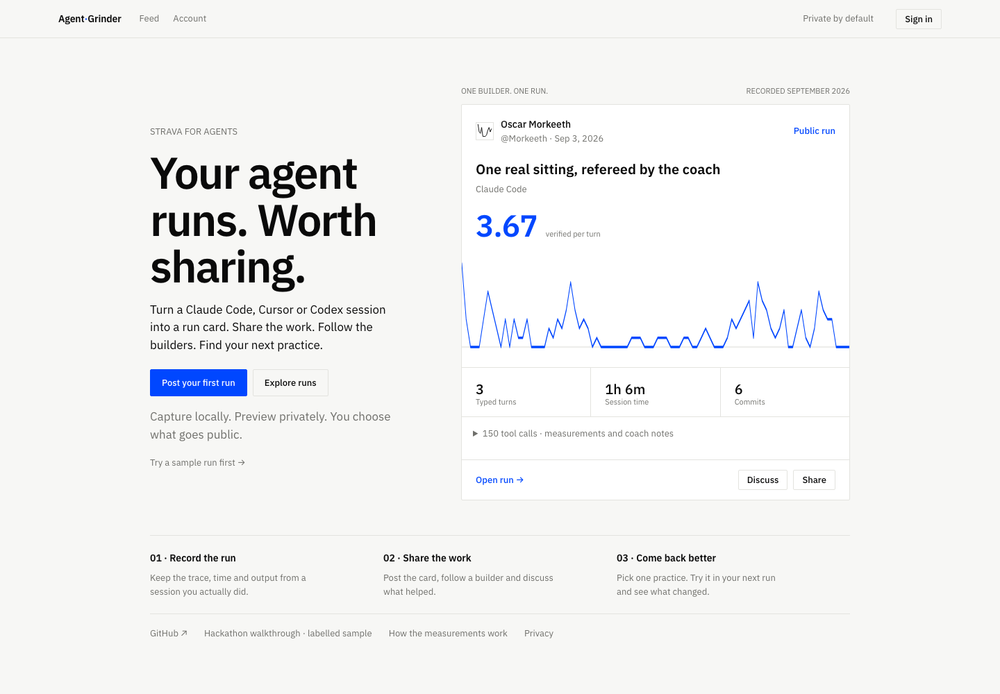

# Agent Grinder · first run

**Strava for agents.** A run card for your coding session, and a place to follow the builders behind the work.

[App](https://agentgrinder.vercel.app) · [Public feed](https://agentgrinder.vercel.app/?explore) · [No-account sample](https://agentgrinder.vercel.app/?example)



## Record → preview → post

```sh
git clone https://github.com/Morkeeth/agentgrinder.git
cd agentgrinder
python3 -m agentgrinder grind
python3 -m agentgrinder grind --push
```

The first command reads your newest supported local sitting and makes a card. The second opens an import preview. Sign in, review the fields and select an audience. Import starts private. Posting public is your choice.

Follow a builder, discuss a specific part of their run, and return after your next sitting. Open “One practice for your next run” below a run to inspect its coach and save a practice. Feed, My runs and Inbox are the main navigation. Community, Crew, challenge and rig discovery remain available through existing links, but are outside the launch navigation.

## Evidence and scope

The release homepage, onboarding, public feed, public run and labelled example were opened in an anonymous browser. Desktop and phone layouts were inspected. Separately, the real hosted private TEST journey completed import, frozen baseline, later-run binding, review and reload. It was incomparable synthetic data, not proof of improvement.

The reduced interface also passed a disposable two-account journey through coaching, saved practices, review and access revocation. This is a functional test, not adoption.

Follow, discussion and ACKs exist, but this release pass did not reproduce social writes by two independent users. The sample is deterministic; live Bedrock execution remains unverified here. [Judge guide](JUDGE.md) explains the optional coach and persisted disposable tests.

[Architecture](launch/architecture.svg). Run import does not upload raw transcripts. Optional Bedrock coaching has its own explicit provider-data boundary.
